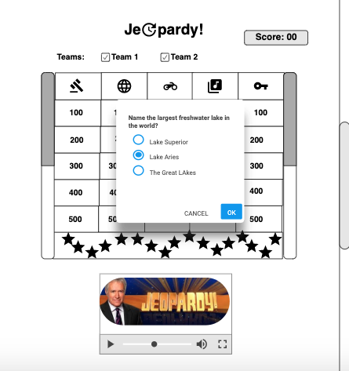

# Jeopardy !!
For Project one I decided to implement a simple Jeopardy game. 

Once players come to the site, they can enter team names.

## Links

[Trello](https://trello.com/b/flB78Yx0/jordan-clarke-project-board)

[Project] (https://sei22jeopardy.netlify.com/)

## Technologies Used
- Languauges- HTML5, CSS, Javascript, JQuery
- Design- GoogleFonts
- Wireframing & User Stories- Trello & Moqup
- Visual Studio Code

## Wireframe
Startup: 

When a question appears: 

## Future Development
- Add more interactive abilities
- Add some more design features and music to the game.
- Implement bootstrapping methods